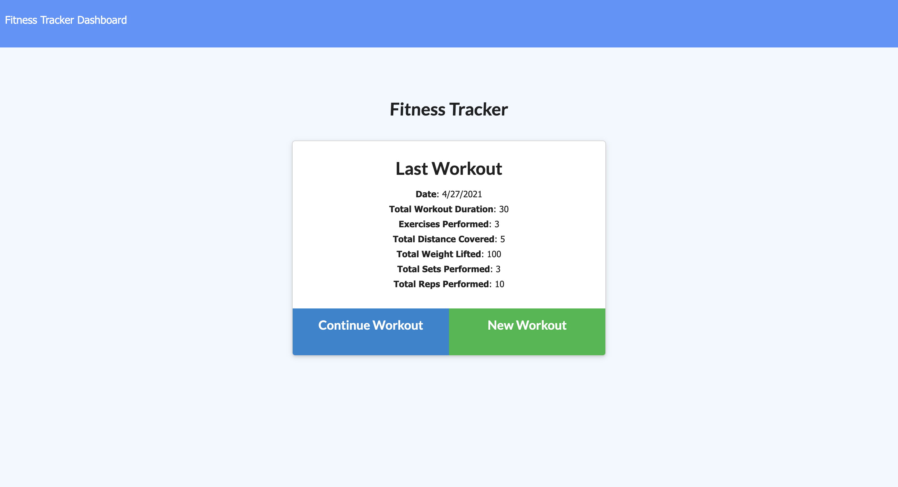
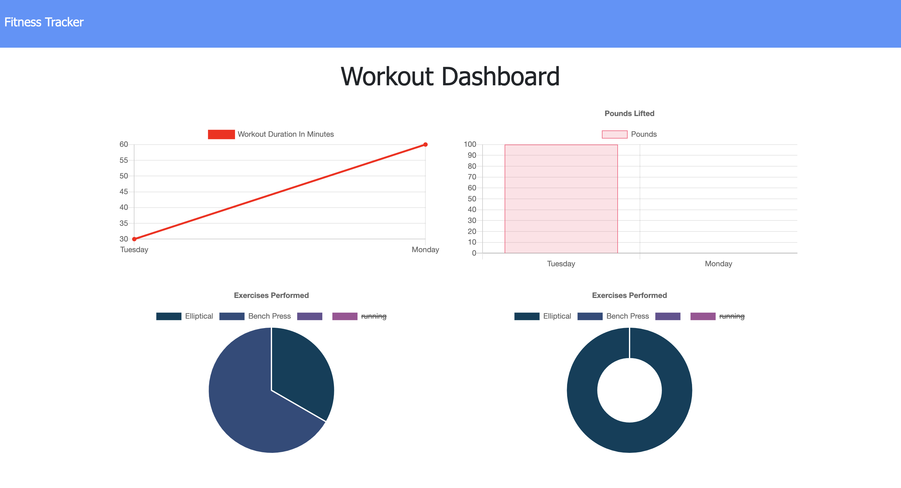
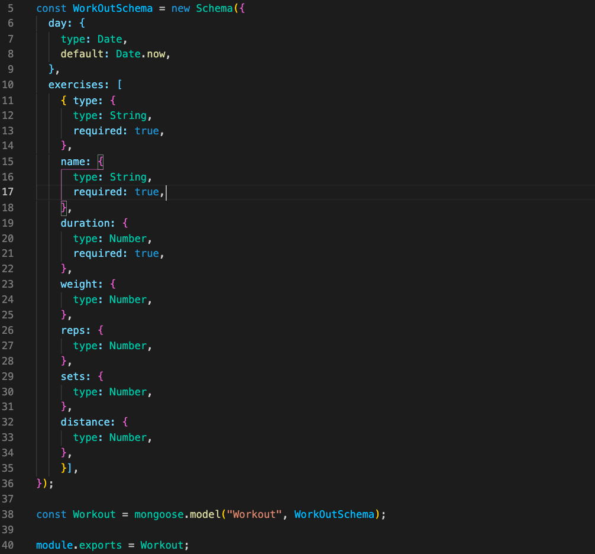
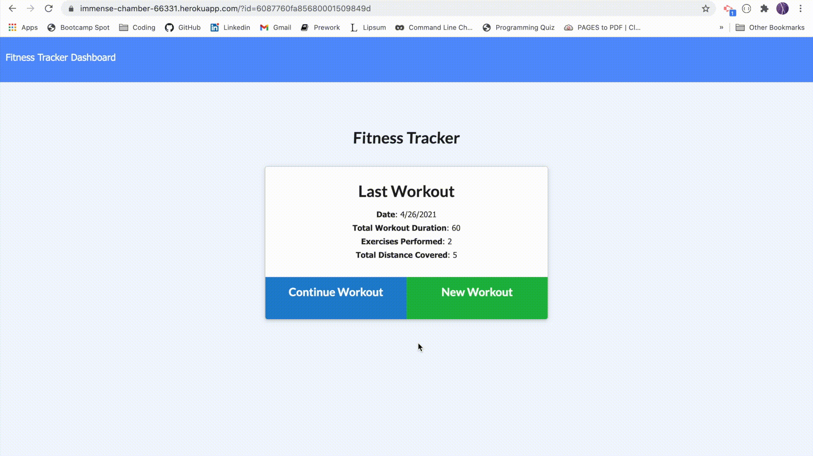

# workout-tracker

# Description

The Workout Tracker is perfect for those looking to improve their fitness. This application allows the User to track both Cardio and Resistance Training.

# Table of Contents

- [Usage](#screenshots)
- [Code](#code)
- [Link](#link)
- [Demo](#demo)
- [Questions](#questions)
- [License](#license)

## Usage

The User can choose to add as many Cardio or Resistance exercises to their workout as they like.

Once they have Completed the Workout, they can view their progress on the Dashboard. The Dashboard will show them their Workout Duration in Minutes and the total pounds lifted by day for the past 5 days.

## Code

MongoDB and a Mongoose were utilized to add individual exercises to the database.

## Link

Link to the deployed site: [Workout Tracker](https://immense-chamber-66331.herokuapp.com/)

## Demo

## Questions

If you have any questions, please contact me at jenLkelly@gmail.com.  
You can also visit my [Github Page](https://github.com/jkelly101).

## License

- https://choosealicense.com/licenses/mit/
